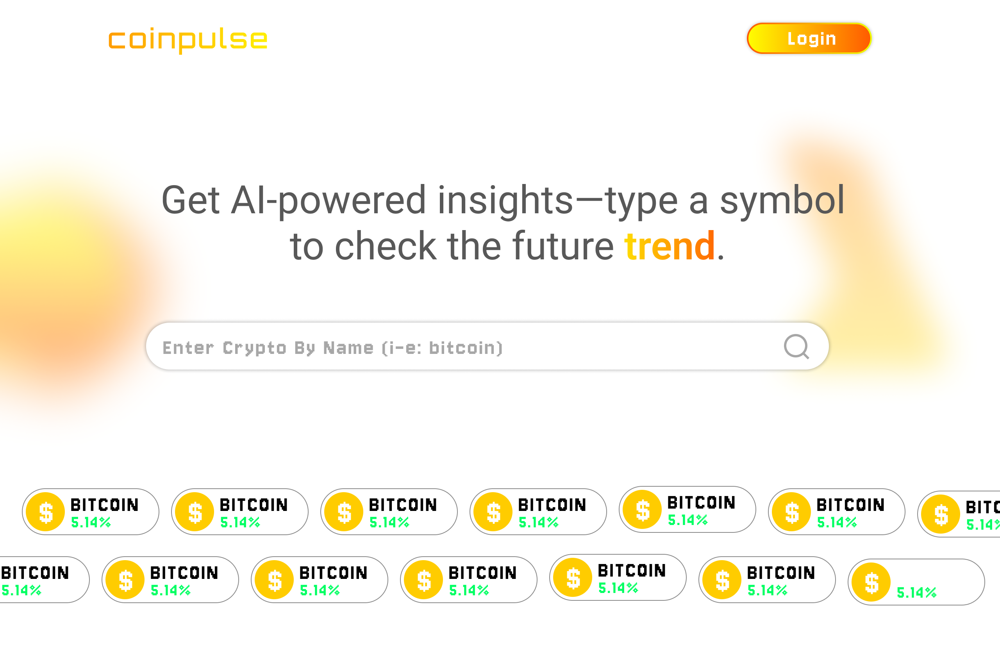

# Coinpulse: AI-Powered Crypto Trend Analyzer

## The Future Pulse Of Crypto Trend

Coinpulse uses APIs to fetch the latest news about cryptocurrencies, analyzes the data using AI, and responds with insights.

🚀 Tech Stack
- Frontend: React, Tailwind CSS / MUI
- Backend: Node.js, Express
- AI: Gemini API

## Coinpulse website preloader :

## Coinpulse UI/UX:

### Design and Developed by shamroz khan 