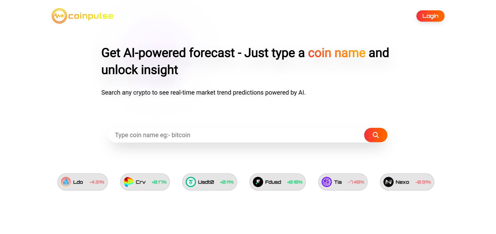

# Coinpulse: Know Every beats of your coin

### 🔷 What is Coinpulse?

🚀 An AI-Powered SaaS Web Application for both beginner and professional traders.

#
### 🔍 How it works:
When a user inputs a coin name (e.g., Bitcoin, Ethereum) , it fetches news from a trusted API related to that coin.
The AI then analyzes the news and responds with the coin's trend with 88% accuracy✅.
##

###  Features:
- 🧠 **AI News Analyzer**
- 📊 **Sentiment Insights**
- 🔍 **Search Any Coin**
- 🧩 **Clean UI + Fast UX**
- 📰 **Real-Time News Feed**

## Coinpulse website preloader :

### Logo :
 

## Coinpulse UI/UX:

<!--  -->

### Design and Developed by shamroz khan 😎